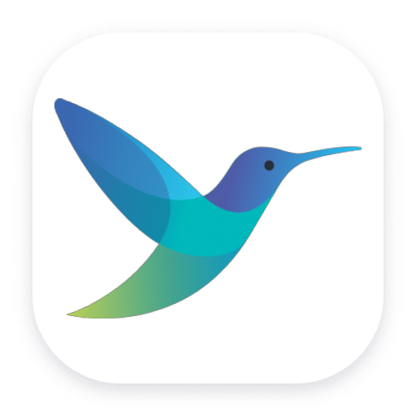

# Seoyul Yoon👋

> **A cloud-native engineer who learns from the community and proves it in production.**

## 🚀 Profile

- **Position**: SK Inc. AX Cloud Application Engineer
- **Primary Role**: Application development for achieving observability and increasing productivity
- **Tech Community**: [Cloud Native Community Korea](https://community.cncf.io/cloud-native-community-korea/) | [Slack](https://cloud-native.slack.com/channels/cncf-korea-community)
- **Open Source**: Kubernetes (SIG DOCS) [DevStats](https://devstats.cluster.fun/?user=seo-yul)
- **Specialization**: Cloud native architecture, Cloud management platform development (Kubernetes Operator, API Gateway, DevOps automation)

## 📊 CNCF DevStats!

<!-- DEVSTATS_START -->

<!-- DEVSTATS_END -->

## 🛠 Tech Stack

### Core Technologies

  

### Skills & Experience

  
  
  

## 💼 Project

**AXMP AI Agent Studio**
- MCP Server Builder operator development
- FastAPI development for OpenAPI-to-MCP conversion
- Repository-Adapter Pattern architecture

**Modernization Platform API Management (APIM)**
- Kubernetes native gateway and API management service platform development
- API public portal, usage approval, registration, and permission management system development
- API logging, monitoring, security, and traffic control solution architecture

### Key Achievements
- **Deployment Efficiency**: Reduced delivery lead time from 3 days to 1 day with Helm packaging
- **Performance Optimization**: Reduced frontend deployment time by 60% (30m → 10m) with multi-architecture build support
- **Infrastructure Automation**: Built CI/CD pipelines and implemented Blue-Green deployment automation
- **Monitoring**: Developed Kubernetes resource management operator and multi-cluster Kubernetes metrics aggregation API
- **Performance Improvement**: Resolved latency issues and OOM errors by migrating event receiver tech stack from Java to Go
- **Cost Optimization**: Adopted Scheduled Auto Scaling and ARM architecture

## 🌟 Community Activities

### Leadership Positions
- **Cloud Native Community Korea** (2026~ ) - Head of Community Ops & Organizer
- **Kubernetes Organization Member** (2022~ 2025) - SIG DOCS Korean localization contributor
- **NAVER Cloud Platform Tech Ambassador** (2023~ 2026.02) - Led tech community operations and offline meetups
- **GopherCon Korea 2023, 2024 Organizer** - Organized Korea's first Golang conference, managed sponsorships
- **KCD Korea 2023 Organizer** - Committee (Swag Planning)

### Speaking Engagements
- **Datadog Korea User Group** (2025.02)
  "Log-Based API Management Strategies and Gateway Utilization in MSA"
- **AWS Korea User Group #architecture** (2022.06)
  "Mastering Infrastructure Benchmark Testing"

### Recognition
- **2022 Open Source Contribution Academy** Lead Mentee - Awarded the NIPA Director's Prize

## 📜 Certifications

### Kubernetes & Cloud Native
- **Kubestronaut** (2026)
- **CKS**: Certified Kubernetes Security Specialist (2026)
- **KCSA**: Kubernetes and Cloud Native Security Associate (2025)
- **KCNA**: Kubernetes and Cloud Native Associate (2024)
- **CKAD**: Certified Kubernetes Application Developer (2024)
- **CKA**: Certified Kubernetes Administrator (2023)

### AWS
- **AWS Certified Data Engineer – Associate** (2024)
- **AWS Certified SysOps Administrator: Associate** (2024)
- **AWS Certified Developer: Associate** (2023)
- **AWS Certified Solutions Architect: Associate** (2022)

## 🎯 Engineering Philosophy

> "Mutual growth through sustainable development and open source contribution"

- **Motivation**: A determination to grow as an IT engineer that started from a remote pet feeding project for a friend's dog
- **International Experience**: Learned the importance of communication through working in Japan and collaborating with teams in Vietnam
- **Open Source Philosophy**: The joy of communication is the driving force of growth
- **Technical Contribution**: Advancing the global open source ecosystem and improving tech accessibility in Korea

---

💬 **Contact**: Open source contributions and [community collaboration](mailto:seoyul@devops.ai.kr) are welcome
